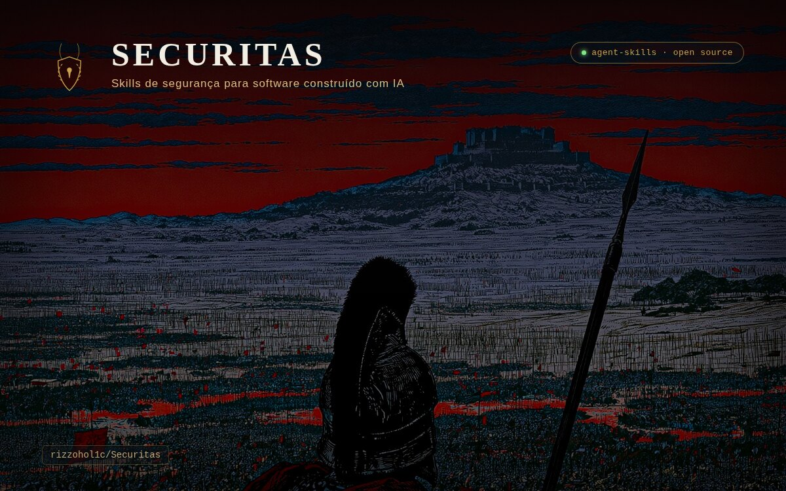

<h1 align="center">
  
</h1>

<p align="center">
  <a href="https://github.com/rizzohol1c/Securitas/actions/workflows/validate-skills.yml"></a>
  <a href="LICENSE"></a>
  <a href="skills/README.md"></a>
  <a href="https://agentskills.io/specification"></a>
</p>

*Securitas*, deusa romana da segurança e da estabilidade, dá nome a este
projeto: skills de segurança e boas práticas para quem constrói SaaS com
ferramentas de IA (Claude Code, Cursor, Copilot, v0 etc.), no fluxo de
"vibe coding", onde boa parte do código nasce de IA em ciclos rápidos de
iteração.

## Por que este repositório existe

Vibe coding acelera a criação de produtos, mas também acelera vulnerabilidades:
segredos commitados sem querer, permissões abertas demais no banco,
dependências aceitas sem revisão, prompts vulneráveis a injeção. A IA que
gera o código raramente pensa em segurança por padrão. Quem precisa
pensar nisso é quem revisa.

Cada pasta numerada (`01`–`10`) documenta um tema de segurança com foco
prático em SaaS construído com apoio de IA. Dentro desses temas, os
frameworks de base e os padrões de vulnerabilidade mais recorrentes
viram skills instaláveis de verdade em [`skills/`](skills/README.md):
arquivos `SKILL.md` no formato aberto
[Agent Skills](https://agentskills.io/specification), que qualquer
agente de IA compatível (Claude Code, Codex, Copilot CLI, Gemini CLI
etc.) instala e usa nativamente, não só lê como documentação.

Estrutura, taxonomia das skills, formato do `SKILL.md` e metodologia de
validação estão documentados em [`ARCHITECTURE.md`](ARCHITECTURE.md).

## Objetivos

- Documentar boas práticas de segurança organizadas por tema (skill),
  priorizando os riscos mais comuns em produtos vibe-coded.
- Criar checklists aplicáveis antes de colocar um SaaS em produção.
- Registrar exemplos reais (sanitizados) de vulnerabilidades encontradas e
  como foram corrigidas.
- Servir de referência rápida para revisar código gerado por IA antes de
  aceitar (fluxo "generate → review → harden").

## Frameworks de base

Todo o conteúdo parte de quatro frameworks reconhecidos da indústria,
documentados em [`00-frameworks-base/`](00-frameworks-base/README.md) e
espelhados como skill em `skills/` (conteúdo oficial completo, atualizado
por script, ver `ARCHITECTURE.md`):

- **OWASP Top 10.** Vulnerabilidades clássicas de aplicação web.
- **OWASP Top 10 for LLM Applications** (2025). Riscos específicos de IA:
  prompt injection, improper output handling, excessive agency etc.
- **OWASP ASVS.** Transforma os dois acima em requisitos verificáveis,
  com nível de rigor (L1/L2/L3).
- **NIST SSDF** (+ perfil para IA generativa, SP 800-218A). Posiciona
  cada prática no ciclo de vida do desenvolvimento, não só como auditoria
  no final.

## Estrutura de pastas

```
.
├── 00-frameworks-base/          # doc: os 4 frameworks acima, resumo + link pra skill
├── 01-fundamentos/              # doc: conceitos base: CIA triad, threat modeling, OWASP Top 10
├── 02-autenticacao-autorizacao/ # doc: login, sessão, RBAC, RLS (Supabase/Postgres), JWT
├── 03-gestao-de-segredos/       # doc: API keys, .env, secret managers, rotação
├── 04-seguranca-llm-ia/         # doc: prompt injection, OWASP LLM Top 10, excessive agency de agentes
├── 05-dependencias-supply-chain/# doc: pacotes de terceiros, código gerado por IA, SBOM
├── 06-infraestrutura-cloud/     # doc: deploy, redes, buckets, permissões de nuvem
├── 07-dados-e-privacidade/      # doc: LGPD/GDPR, criptografia, minimização de dados
├── 08-ci-cd-deploy/             # doc: pipelines, secrets em CI, revisão antes de merge
├── 09-monitoramento-resposta/   # doc: logging, alertas, plano de resposta a incidentes
├── 10-checklists-templates/     # doc: checklists prontos para usar, derivados do ASVS
├── skills/                      # PRODUTO: skills instaláveis (Agent Skills spec) — 4 framework-mirror + 13 vulnerability-pattern
├── scripts/                     # regenera skills framework-mirror da fonte oficial + valida schema
├── .github/workflows/           # CI: validação de schema + checagem semanal de frescor
├── ARCHITECTURE.md              # como tudo isso se encaixa
├── CLAUDE.md                    # guia para agentes de IA (AGENTS.md e GEMINI.md são symlinks para este)
├── LICENSE                      # MIT
└── README.md
```

Cada pasta temática tem seu próprio `README.md` com o índice do
conteúdo. A lista completa de skills e como instalar estão em
[`skills/README.md`](skills/README.md); o desenho completo do
repositório está em [`ARCHITECTURE.md`](ARCHITECTURE.md).

## Como uso este repositório

1. Antes de colocar um SaaS novo em produção, passo pelos checklists em
   `10-checklists-templates/`.
2. Ao revisar código gerado por IA, confiro os temas relevantes nas pastas
   `02` a `06` antes de aceitar o PR/commit.
3. Vulnerabilidades reais encontradas (sem dados sensíveis do cliente) viram
   estudo de caso na skill correspondente.
